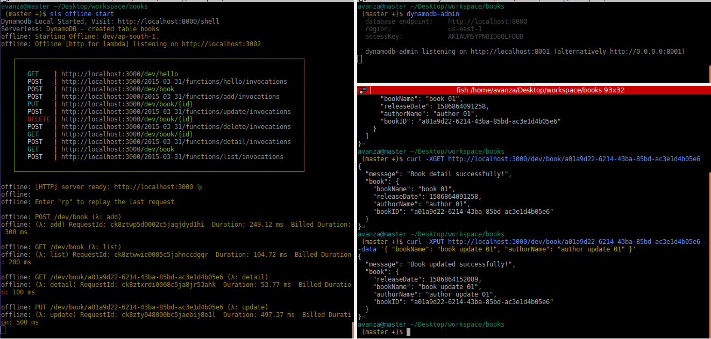

= DyanmoDB Offline Serverless CRUD Example

This is the example for Developing AWS locally with Serverless offline plugins:

Install Serverless framework 

$ `npm install serverless -g`

Check Serverless installation by executing

$ `serverless --version`

Install npm dependencies 

$ `npm install`

Install dynamodb locally

$ `sls dynamodb install`

Start offline serverless

$ `sls offline start`

Now let's setup dynamodb-admin: which gives a good GUI to view our DynamoDB tables

$ `npm install dynamodb-admin -g`

$ `export DYNAMO_ENDPOINT=http://localhost:8000`

$ `dynamodb-admin`

All API testing samples

$ `curl -XGET http://localhost:3000/dev/hello`

$ `curl -XPOST http://localhost:3000/dev/book --data '{ "bookName": "book 01", "authorName": "author 01" }'`

$ `curl -XGET http://localhost:3000/dev/book`

$ `curl -XGET http://localhost:3000/dev/book/a01a9d22-6214-43ba-85bd-ac3e1d4b05e6`

$ `curl -XPUT http://localhost:3000/dev/book/a01a9d22-6214-43ba-85bd-ac3e1d4b05e6 --data '{ "bookName": "book update 01", "authorName": "author update 01" }'`

$ `curl -XDELETE http://localhost:3000/dev/book/a01a9d22-6214-43ba-85bd-ac3e1d4b05e6`

CLI 

